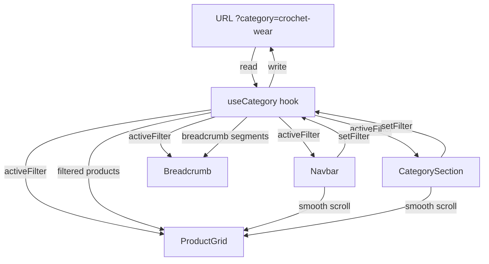
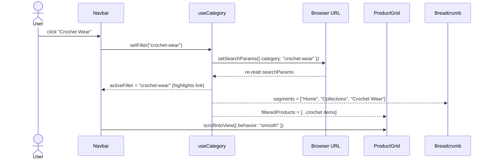
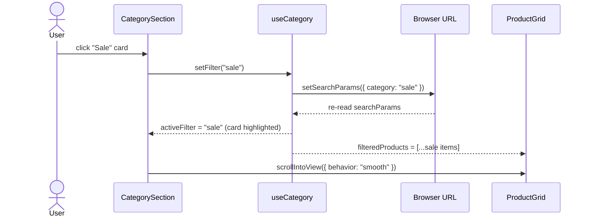
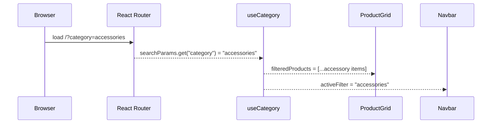

# Design Document: Navigation & Category Routing System

## Overview

This feature replaces the static nav links and inert category cards in the Atelier Angélique storefront with a fully interactive routing and filtering system. Clicking any nav link or category card updates a URL search parameter (`?category=...`), filters the product grid reactively, shows an active/highlighted state on the selected item, renders a breadcrumb trail above the product grid, and smooth-scrolls the viewport to the grid — all without a full page reload.

The system is built entirely within React Router v7's existing `BrowserRouter` setup, using `useSearchParams` for URL-state synchronisation, a shared `useCategory` hook for filter logic, and a new `CategoryFilter` type mapping that unifies the nav link names and category card names into consistent URL slugs.

---

## Architecture



The single `useCategory` hook is the source of truth. It reads `?category` from `useSearchParams`, derives the filtered product list and breadcrumb segments, and exposes a `setFilter` setter that writes back to the URL. All three UI areas (Navbar, CategorySection, ProductGrid) are consumers — they never hold independent local filter state.

---

## Sequence Diagrams

### Nav Link Click Flow



### Category Card Click Flow



### URL Hydration on Page Load



---

## Components and Interfaces

### Component: `useCategory` (custom hook)

**Purpose**: Central state manager for the active category filter — reads/writes URL, derives filtered products and breadcrumb segments.

**Interface**:
```typescript
type CategoryFilter =
  | "all"
  | "crochet-wear"
  | "accessories"
  | "new-in"
  | "sale";

interface UseCategoryReturn {
  /** URL slug of currently active filter */
  activeFilter: CategoryFilter;
  /** Derived filtered + sorted product list */
  filteredProducts: Product[];
  /** Breadcrumb path segments for the active filter */
  breadcrumbSegments: BreadcrumbSegment[];
  /** Update the URL and therefore the active filter */
  setFilter: (filter: CategoryFilter) => void;
  /** Reset to "all" / clear URL param */
  clearFilter: () => void;
}

interface BreadcrumbSegment {
  label: string;
  filter: CategoryFilter | null; // null = non-clickable (current page)
}
```

**Responsibilities**:
- Read `?category` from `useSearchParams`; default to `"all"` when absent or invalid
- Apply filter logic per slug (see Filter Logic section)
- Build breadcrumb segments array
- Expose `setFilter` which calls `setSearchParams`

---

### Component: `Navbar` (updated)

**Purpose**: Top navigation bar; nav links are now interactive filter triggers with active styling.

**Interface**:
```typescript
interface NavbarProps {
  onSearch: (q: string) => void;
}
```

**Internal changes**:
- Receives `activeFilter` and `setFilter` from `useCategory`
- Maps each `settings.navLinks` string to a `CategoryFilter` slug using `NAV_LINK_MAP`
- Applies active class when slug matches `activeFilter`
- On click: calls `setFilter(slug)` then smooth-scrolls to `#product-grid`
- "Home" link: clears filter, scrolls to top instead

**Nav Link Mapping** (`NAV_LINK_MAP`):
```typescript
const NAV_LINK_MAP: Record<string, CategoryFilter | "home"> = {
  "Home":        "home",
  "Shop":        "all",
  "Crochet Wear":"crochet-wear",
  "Accessories": "accessories",
  "New In":      "new-in",
  "Sale":        "sale",
};
```

---

### Component: `CategorySection` (updated)

**Purpose**: Collections grid; each card is now an interactive filter trigger.

**Interface** (no props change — reads from `useCategory` internally):
```typescript
// No external props change
```

**Internal changes**:
- Receives `activeFilter` and `setFilter` from `useCategory`
- Maps each `settings.categories[].name` to a `CategoryFilter` slug using `CATEGORY_CARD_MAP`
- Applies active/selected ring/overlay styling when card slug matches `activeFilter`
- On click: calls `setFilter(slug)`, then smooth-scrolls to `#product-grid`

**Category Card Mapping** (`CATEGORY_CARD_MAP`):
```typescript
const CATEGORY_CARD_MAP: Record<string, CategoryFilter> = {
  "Crochet Wear": "crochet-wear",
  "Accessories":  "accessories",
  "New In":       "new-in",
  "Sale":         "sale",
};
```

---

### Component: `ProductGrid` (updated)

**Purpose**: Renders filtered/sorted product cards; removes local `activeCategory` state.

**Interface**:
```typescript
interface ProductGridProps {
  searchQ: string;
}
```

**Internal changes**:
- Removes `activeCategory` local state and the inline filter buttons (the tab row)
- Receives `filteredProducts` from `useCategory` and further narrows by `searchQ`
- Adds `id="product-grid"` to the section element to be the scroll target
- Renders `<Breadcrumb />` above the product heading when a non-"all" filter is active

---

### Component: `Breadcrumb` (new)

**Purpose**: Shows contextual path above the product grid.

**Interface**:
```typescript
interface BreadcrumbProps {
  segments: BreadcrumbSegment[];
  onNavigate: (filter: CategoryFilter | null) => void;
}
```

**Rendering logic**:
- Hidden when `segments.length <= 1` (i.e. on "all" / home state)
- Renders `Home > Collections > [Category Label]`
- All but the last segment are clickable links using the segment's `filter` value
- Last segment is plain text (current location, not clickable)

---

## Data Models

### `CategoryFilter` Slug → Display Label Map

```typescript
const FILTER_LABELS: Record<CategoryFilter, string> = {
  "all":          "All Products",
  "crochet-wear": "Crochet Wear",
  "accessories":  "Accessories",
  "new-in":       "New In",
  "sale":         "Sale",
};
```

### Filter Logic per Slug

```typescript
interface FilterRule {
  slug: CategoryFilter;
  /** Returns true when a product passes the filter */
  test: (product: Product) => boolean;
  /** Optional sort applied after filtering */
  sort?: (a: Product, b: Product) => number;
}
```

| Slug | `test` predicate | `sort` |
|------|-----------------|--------|
| `"all"` | `() => true` | none |
| `"crochet-wear"` | `p.category === "Crochet Wear"` | none |
| `"accessories"` | `p.category === "Accessories"` | none |
| `"new-in"` | `p.badge === "New"` (current proxy; see note) | newest-badge first |
| `"sale"` | `p.originalPrice !== undefined` | none |

> **Note on "New In"**: Products lack a `createdAt` timestamp in the current data model. The initial implementation uses `badge === "New"` as a proxy. A `createdAt?: string` field should be added to the `Product` type to support true 30-day filtering in a later iteration. This is called out explicitly in the requirements.

### Updated `Product` Type (additive)

```typescript
export type Product = {
  id: string;
  name: string;
  category: string;
  price: number;
  originalPrice?: number;
  image: string;
  badge?: string;
  description: string;
  stock: number;
  createdAt?: string; // ISO 8601 — added for "New In" temporal filtering
};
```

### `BreadcrumbSegment`

```typescript
interface BreadcrumbSegment {
  label: string;
  filter: CategoryFilter | null;
}
```

Breadcrumb segments per filter:

| Active Filter | Segments |
|--------------|----------|
| `"all"` | `[]` (hidden) |
| `"crochet-wear"` | `Home(all) > Collections(null*) > Crochet Wear(null)` |
| `"accessories"` | `Home(all) > Collections(null*) > Accessories(null)` |
| `"new-in"` | `Home(all) > Collections(null*) > New In(null)` |
| `"sale"` | `Home(all) > Collections(null*) > Sale(null)` |

> `null*` means "Collections" is a label-only node (no single filter maps to it).

---

## Algorithmic Pseudocode

### Main Filter & Sort Algorithm

```pascal
FUNCTION deriveFilteredProducts(products, activeFilter, searchQ)
  INPUT:  products    : Product[]
          activeFilter: CategoryFilter
          searchQ     : string
  OUTPUT: result      : Product[]

  PRECONDITIONS:
    - products is a non-null array
    - activeFilter is one of the valid CategoryFilter values
    - searchQ may be empty string

  result ← products

  -- Apply category filter
  IF activeFilter = "crochet-wear" THEN
    result ← FILTER result WHERE p.category = "Crochet Wear"
  ELSE IF activeFilter = "accessories" THEN
    result ← FILTER result WHERE p.category = "Accessories"
  ELSE IF activeFilter = "new-in" THEN
    result ← FILTER result WHERE p.badge = "New"
              OR (p.createdAt IS NOT NULL AND daysSince(p.createdAt) ≤ 30)
    SORT result BY createdAt DESC NULLS LAST
  ELSE IF activeFilter = "sale" THEN
    result ← FILTER result WHERE p.originalPrice IS NOT NULL
  END IF
  -- "all" applies no filter

  -- Apply search query (secondary, always applied on top)
  IF searchQ IS NOT EMPTY THEN
    result ← FILTER result WHERE
      LOWERCASE(p.name) CONTAINS LOWERCASE(searchQ)
      OR LOWERCASE(p.category) CONTAINS LOWERCASE(searchQ)
  END IF

  RETURN result

  POSTCONDITIONS:
    - Every item in result passed both the category filter and search filter
    - For "new-in": result is sorted newest first
    - For all other filters: original product order is preserved
END FUNCTION
```

### Breadcrumb Builder Algorithm

```pascal
FUNCTION buildBreadcrumbs(activeFilter)
  INPUT:  activeFilter : CategoryFilter
  OUTPUT: segments     : BreadcrumbSegment[]

  IF activeFilter = "all" THEN
    RETURN []
  END IF

  label ← FILTER_LABELS[activeFilter]

  segments ← [
    { label: "Home",        filter: "all" },
    { label: "Collections", filter: null  },
    { label: label,         filter: null  },
  ]

  RETURN segments
END FUNCTION
```

### `setFilter` with Smooth Scroll

```pascal
PROCEDURE setFilter(slug, scrollTargetId)
  INPUT: slug          : CategoryFilter
         scrollTargetId: string  -- e.g. "product-grid"

  IF slug = "home" THEN
    clearSearchParams()
    scrollTo(top, behavior="smooth")
    RETURN
  END IF

  setSearchParams({ category: slug })
  -- Scroll is deferred one frame so the DOM update settles first
  SCHEDULE_NEXT_FRAME:
    element ← document.getElementById(scrollTargetId)
    IF element IS NOT NULL THEN
      element.scrollIntoView({ behavior: "smooth", block: "start" })
    END IF
END PROCEDURE
```

---

## Key Functions with Formal Specifications

### `useCategory()` hook

**Preconditions:**
- Must be called inside a component within `<RouterProvider>` (React Router v7 context present)
- `useApp()` context must be available (`products` and `settings` accessible)

**Postconditions:**
- `activeFilter` always equals a valid `CategoryFilter` value — falls back to `"all"` for any unrecognised URL value
- `filteredProducts` is a subset (or equal) of `products` from `AppContext`
- `breadcrumbSegments` has length 0 when `activeFilter === "all"`, length 3 otherwise
- Calling `setFilter("sale")` updates the URL to `?category=sale`; calling `setFilter("all")` removes the `category` param entirely

### `slugToFilter(raw: string): CategoryFilter`

```typescript
function slugToFilter(raw: string | null): CategoryFilter
```

**Preconditions:** `raw` is any string or null (untrusted URL input)

**Postconditions:**
- Returns a valid `CategoryFilter` in all cases
- If `raw` is not in the known set, returns `"all"`
- Never throws

### `scrollToGrid(id: string): void`

**Preconditions:** Called after `setSearchParams` (state update has been issued)

**Postconditions:**
- Element with `id` exists in the DOM
- `scrollIntoView` is called with `{ behavior: "smooth" }`
- If element is not found, function exits silently without error

---

## Error Handling

### Unknown URL category value

**Condition**: User visits `/?category=not-a-real-category` directly (bookmarked or typed)

**Response**: `slugToFilter` returns `"all"`; all products are shown; no error displayed

**Recovery**: Automatic — the URL param is left as-is (not corrected) to avoid unexpected redirects; the UI simply shows all products as if no filter were active

---

### Product grid element not found during scroll

**Condition**: `document.getElementById("product-grid")` returns null (component not mounted yet, or id typo)

**Response**: Silent no-op — scroll is skipped

**Recovery**: None needed; filter still applied correctly via URL

---

### `setFilter` called with "home"

**Condition**: "Home" nav link clicked — `"home"` is not a valid `CategoryFilter`

**Response**: Clears `?category` param, scrolls to top of page

**Recovery**: Not an error — handled as a special case in `setFilter`

---

## Testing Strategy

### Unit Testing Approach

Test the `useCategory` hook in isolation using React Testing Library's `renderHook`:

- `deriveFilteredProducts` with each `CategoryFilter` value returns only matching products
- `deriveFilteredProducts` with `searchQ` applied on top of a category filter
- `buildBreadcrumbs` returns correct segments for every filter value
- `buildBreadcrumbs` returns `[]` for `"all"`
- `slugToFilter` returns `"all"` for null, empty string, and unrecognised values
- `slugToFilter` returns the correct `CategoryFilter` for each valid slug

### Property-Based Testing Approach

**Property Test Library**: fast-check

**Properties to verify**:

1. **Filter completeness**: For any product list and any `CategoryFilter`, every product in the output satisfies the filter predicate — and no product that fails the predicate appears in the output.

2. **Search narrowing**: For any non-empty `searchQ` applied on top of an already-filtered list, the result is a subset (≤) of the filter-only result.

3. **Breadcrumb non-empty invariant**: For any `CategoryFilter` that is not `"all"`, `buildBreadcrumbs` always returns exactly 3 segments.

4. **URL round-trip**: For any valid `CategoryFilter` slug, writing it to `searchParams` and reading it back via `slugToFilter` returns the same value.

### Integration Testing Approach

- Click "Crochet Wear" nav link → URL becomes `?category=crochet-wear`, product grid shows only Crochet Wear items, breadcrumb shows `Home > Collections > Crochet Wear`
- Click "Sale" category card → URL becomes `?category=sale`, only products with `originalPrice` are shown
- Directly load `/?category=accessories` → accessories filter is pre-applied on mount
- Load `/?category=bogus` → all products shown, no crash
- Search "crochet" while "Accessories" filter is active → result is intersection (accessories containing "crochet" in name/category)
- Click "Home" nav link → filter cleared, page scrolls to top

---

## Performance Considerations

- Filtering is performed in-memory on the client. With the current dataset (8–~50 products), no pagination or virtualisation is needed.
- `filteredProducts` derivation in `useCategory` should be wrapped in `useMemo` with `[products, activeFilter, searchQ]` as dependencies to avoid redundant recomputation on unrelated renders.
- Smooth-scroll is native (`scrollIntoView`) — no animation library overhead required.
- URL writes via `setSearchParams` do not trigger a full page reload in React Router v7.

---

## Security Considerations

- `?category` is a read-only display hint — it controls which products are shown client-side but carries no authentication or authorisation implications.
- `slugToFilter` sanitises untrusted URL input by whitelisting known values; all other strings fall through to `"all"`.
- No user-supplied URL content is ever rendered as HTML — only used to select a string key from a predefined map.

---

## Dependencies

| Dependency | Already installed | Purpose |
|-----------|------------------|---------|
| `react-router` v7 | ✅ | `useSearchParams` for URL sync |
| `motion/react` (Framer Motion) | ✅ | Breadcrumb + active-state animations |
| `tailwindcss` | ✅ | Active state and hover styling |
| `lucide-react` | ✅ | Breadcrumb separator chevron icon |
| `fast-check` | ❌ — dev dependency needed | Property-based tests |

No new runtime dependencies are introduced.
